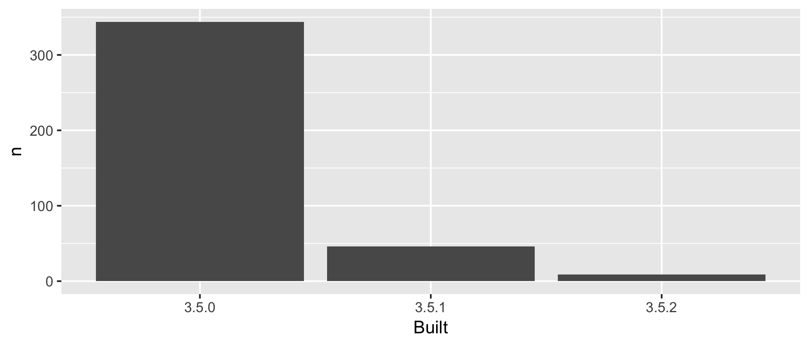

<!-- README.md is generated from README.Rmd. Please edit that file -->
wtf-packages-report
===================

Overview
--------

The goal of wtf-packages-report is to explore the packages in my R installation!

I have 399 add-on packages installed.

Here's how they break down in terms of which version of R they were built under, which is related to how recently they were updated on CRAN.

| Built |    n|  prop|
|:------|----:|-----:|
| 3.5.0 |  344|  0.86|
| 3.5.1 |   46|  0.12|
| 3.5.2 |    9|  0.02|



### Flow of the analysis

Run [R/90\_make-clean.R](R/90_make-clean.R) to clean out downstream products.

Run [R/95\_make-all.R](R/95_make-all.R) to re-run the analysis and re-render this README.

<table>
<colgroup>
<col width="27%" />
<col width="27%" />
<col width="44%" />
</colgroup>
<thead>
<tr class="header">
<th>Input</th>
<th>Script</th>
<th>Output</th>
</tr>
</thead>
<tbody>
<tr class="odd">
<td></td>
<td><a href="R/01_write-installed-packages.R" class="uri">R/01_write-installed-packages.R</a></td>
<td><a href="data/installed-packages.csv" class="uri">data/installed-packages.csv</a></td>
</tr>
<tr class="even">
<td><a href="data/installed-packages.csv" class="uri">data/installed-packages.csv</a></td>
<td><a href="R/02_wrangle-packages.R" class="uri">R/02_wrangle-packages.R</a></td>
<td><a href="data/add-on-packages.csv" class="uri">data/add-on-packages.csv</a><br><a href="data/add-on-packages-freqtable.csv" class="uri">data/add-on-packages-freqtable.csv</a></td>
</tr>
<tr class="odd">
<td><a href="data/add-on-packages-freqtable.csv" class="uri">data/add-on-packages-freqtable.csv</a></td>
<td><a href="R/03_barchart-packages-built.R" class="uri">R/03_barchart-packages-built.R</a></td>
<td><a href="figs/built-barchart.png" class="uri">figs/built-barchart.png</a></td>
</tr>
</tbody>
</table>

<details>

<summary>Session info</summary>

``` r
devtools::session_info()
#> - Session info ----------------------------------------------------------
#>  setting  value                       
#>  version  R version 3.5.1 (2018-07-02)
#>  os       Windows >= 8 x64            
#>  system   x86_64, mingw32             
#>  ui       RStudio                     
#>  language (EN)                        
#>  collate  Italian_Italy.1252          
#>  ctype    Italian_Italy.1252          
#>  tz       America/Chicago             
#>  date     2019-02-01                  
#> 
#> - Packages --------------------------------------------------------------
#>  package     * version date       lib source        
#>  assertthat    0.2.0   2017-04-11 [1] CRAN (R 3.5.1)
#>  backports     1.1.3   2018-12-14 [1] CRAN (R 3.5.2)
#>  bindr         0.1.1   2018-03-13 [1] CRAN (R 3.5.2)
#>  bindrcpp    * 0.2.2   2018-03-29 [1] CRAN (R 3.5.2)
#>  broom         0.5.1   2018-12-05 [1] CRAN (R 3.5.2)
#>  callr         3.1.1   2018-12-21 [1] CRAN (R 3.5.2)
#>  cellranger    1.1.0   2016-07-27 [1] CRAN (R 3.5.2)
#>  cli           1.0.1   2018-09-25 [1] CRAN (R 3.5.1)
#>  colorspace    1.3-2   2016-12-14 [1] CRAN (R 3.5.1)
#>  crayon        1.3.4   2017-09-16 [1] CRAN (R 3.5.1)
#>  desc          1.2.0   2018-05-01 [1] CRAN (R 3.5.2)
#>  devtools      2.0.1   2018-10-26 [1] CRAN (R 3.5.2)
#>  digest        0.6.18  2018-10-10 [1] CRAN (R 3.5.1)
#>  dplyr       * 0.7.8   2018-11-10 [1] CRAN (R 3.5.2)
#>  evaluate      0.12    2018-10-09 [1] CRAN (R 3.5.2)
#>  forcats     * 0.3.0   2018-02-19 [1] CRAN (R 3.5.2)
#>  fs            1.2.6   2018-08-23 [1] CRAN (R 3.5.2)
#>  generics      0.0.2   2018-11-29 [1] CRAN (R 3.5.2)
#>  ggplot2     * 3.1.0   2018-10-25 [1] CRAN (R 3.5.1)
#>  glue          1.3.0   2018-07-17 [1] CRAN (R 3.5.1)
#>  gtable        0.2.0   2016-02-26 [1] CRAN (R 3.5.1)
#>  haven         2.0.0   2018-11-22 [1] CRAN (R 3.5.2)
#>  here          0.1     2017-05-28 [1] CRAN (R 3.5.2)
#>  highr         0.7     2018-06-09 [1] CRAN (R 3.5.2)
#>  hms           0.4.2   2018-03-10 [1] CRAN (R 3.5.2)
#>  htmltools     0.3.6   2017-04-28 [1] CRAN (R 3.5.2)
#>  httr          1.4.0   2018-12-11 [1] CRAN (R 3.5.2)
#>  jsonlite      1.6     2018-12-07 [1] CRAN (R 3.5.2)
#>  knitr         1.21    2018-12-10 [1] CRAN (R 3.5.2)
#>  lattice       0.20-35 2017-03-25 [2] CRAN (R 3.5.1)
#>  lazyeval      0.2.1   2017-10-29 [1] CRAN (R 3.5.1)
#>  lubridate     1.7.4   2018-04-11 [1] CRAN (R 3.5.2)
#>  magrittr      1.5     2014-11-22 [1] CRAN (R 3.5.1)
#>  memoise       1.1.0   2017-04-21 [1] CRAN (R 3.5.2)
#>  modelr        0.1.2   2018-05-11 [1] CRAN (R 3.5.2)
#>  munsell       0.5.0   2018-06-12 [1] CRAN (R 3.5.1)
#>  nlme          3.1-137 2018-04-07 [2] CRAN (R 3.5.1)
#>  pillar        1.3.0   2018-07-14 [1] CRAN (R 3.5.1)
#>  pkgbuild      1.0.2   2018-10-16 [1] CRAN (R 3.5.2)
#>  pkgconfig     2.0.2   2018-08-16 [1] CRAN (R 3.5.2)
#>  pkgload       1.0.2   2018-10-29 [1] CRAN (R 3.5.2)
#>  plyr          1.8.4   2016-06-08 [1] CRAN (R 3.5.1)
#>  prettyunits   1.0.2   2015-07-13 [1] CRAN (R 3.5.2)
#>  processx      3.2.1   2018-12-05 [1] CRAN (R 3.5.2)
#>  ps            1.3.0   2018-12-21 [1] CRAN (R 3.5.2)
#>  purrr       * 0.3.0   2019-01-27 [1] CRAN (R 3.5.2)
#>  R6            2.3.0   2018-10-04 [1] CRAN (R 3.5.1)
#>  Rcpp          1.0.0   2018-11-07 [1] CRAN (R 3.5.1)
#>  readr       * 1.3.1   2018-12-21 [1] CRAN (R 3.5.2)
#>  readxl        1.2.0   2018-12-19 [1] CRAN (R 3.5.2)
#>  remotes       2.0.2   2018-10-30 [1] CRAN (R 3.5.2)
#>  rlang         0.3.1   2019-01-08 [1] CRAN (R 3.5.2)
#>  rmarkdown     1.11    2018-12-08 [1] CRAN (R 3.5.2)
#>  rprojroot     1.3-2   2018-01-03 [1] CRAN (R 3.5.2)
#>  rstudioapi    0.9.0   2019-01-09 [1] CRAN (R 3.5.2)
#>  rvest         0.3.2   2016-06-17 [1] CRAN (R 3.5.2)
#>  scales        1.0.0   2018-08-09 [1] CRAN (R 3.5.1)
#>  sessioninfo   1.1.1   2018-11-05 [1] CRAN (R 3.5.2)
#>  stringi       1.2.4   2018-07-20 [1] CRAN (R 3.5.1)
#>  stringr     * 1.3.1   2018-05-10 [1] CRAN (R 3.5.1)
#>  tibble      * 1.4.2   2018-01-22 [1] CRAN (R 3.5.1)
#>  tidyr       * 0.8.2   2018-10-28 [1] CRAN (R 3.5.2)
#>  tidyselect    0.2.5   2018-10-11 [1] CRAN (R 3.5.2)
#>  tidyverse   * 1.2.1   2017-11-14 [1] CRAN (R 3.5.2)
#>  usethis       1.4.0   2018-08-14 [1] CRAN (R 3.5.2)
#>  withr         2.1.2   2018-03-15 [1] CRAN (R 3.5.1)
#>  xfun          0.4     2018-10-23 [1] CRAN (R 3.5.2)
#>  xml2          1.2.0   2018-01-24 [1] CRAN (R 3.5.2)
#>  yaml          2.2.0   2018-07-25 [1] CRAN (R 3.5.2)
#> 
#> [1] C:/Users/enxhi/OneDrive/Documenti/R/win-library/3.5
#> [2] C:/Program Files/R/R-3.5.1/library
```

</details>
